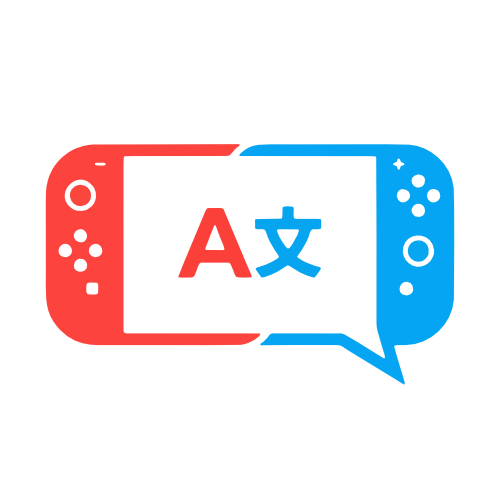

<h1 align="center">TranslateNX </h1>

  

  ---
    
  

  <b>EN</b> TranslateNX is a revolutionary real-time translation overlay for the Nintendo Switch. It seamlessly reads text directly from your games and translates it on-the-fly, breaking language barriers without needing any game-specific patches or mods.

  ---

  <b>TR</b> TranslateNX, Nintendo Switch için devrim niteliğinde anlık çeviri aracıdır. Oyunlardaki metinleri doğrudan okuyup anında çevirerek, oyun yamalarına veya modlarına ihtiyaç duymadan dil engellerini ortadan kaldırır.
  

   

  
  &nbsp;&nbsp;
  

---

## Setup and Usage Guide

### ✨ Features
* **Real-time Translation:** Translate on-screen game text instantly.
* **OCR Technology:** Directly reads text from the screen, no game mods required.
* **Wide Language Support:** Supports over 20 source languages (especially Japanese, English, etc.).
* **Practical Use:** Translate quickly without leaving the game using the UltraHand Overlay menu.
* **Multiple Service Options:** Supports Google Cloud Vision, OCR.space, DeepL, Google Cloud Translate, and MyMemory.

  

### ⚠️ Step 1: Critical Prep (Required)
To prevent your console from crashing, you must increase the **UltraHand memory limit**:
1. Open the UltraHand menu.
2. Press `+` to open settings, then go to **System**.
3. Change **Overlay Memory** from **4MB to 8MB**.

### 💾 Step 2: Installation
**Requirements:** You MUST have [nx-ovlloader](https://github.com/WerWolv/nx-ovlloader) and [Ultrahand-Overlay](https://github.com/ppkantorski/Ultrahand-Overlay) installed for this app to work!

There are two easy ways to install:
* **Option 1 (Zip Extract):** Download the latest release `.zip` file. Extract it and drag all the contents directly to the root of your SD card. The files are already placed in their correct folder paths.
* **Option 2 (Homebrew App Store):** Open the Homebrew App Store on your console, search for "TranslateNX", and download it directly.

### 🔑 Step 3: Getting API Keys
TranslateNX needs services to read (OCR) and translate text. For the best performance, we highly recommend using Google Cloud Vision for OCR and DeepL for Translation.

#### 🔍 OCR API Options
**1. Google Cloud Vision (1000 Uses/Month) — ⭐ RECOMMENDED**
* Go to [Google Cloud Vision](https://console.cloud.google.com/) and click "Try Vision AI Free" to complete registration.
* On the Cloud Vision API page, click the "Enable" button.
* Go to the **Credentials** tab on the left menu. Select **Create Credentials > API Key** from the top.
* Name your API. In the *Select API restrictions* section, choose **Cloud Vision API**, click OK, and then Create. Your API key will appear in seconds.

**2. OCR.space (500 Uses/Day) — Alternative**
* Register at [OCR.space Free Key](https://ocr.space/OCRAPI).
* Click the confirmation link sent to your email. You will receive a second email with your API key seconds after confirming.

#### 🌍 Translation API Options
**1. DeepL (1,000,000 Characters Once) — ⭐ RECOMMENDED**
*(Note: 1 million characters will last a very long time. You can create a new free account when it runs out).*
* Sign up at [DeepL](https://www.deepl.com). Click your profile icon at the top right, then **Account**.
* Go to **API Plans** in the bottom left corner and subscribe to the free plan (it may ask for details but will not charge).
* Go to the **API Keys & Limits** tab and click **Create Key**.
* Name your API, select "All access", and click Create Key.

**2. Google Cloud Translate (500,000 Characters/Month) — Alternative**
*(Note: It may ask for card details and put a small hold during signup, but it is free as long as you stay within the quota).*
* Go to [Google Cloud Translate](https://console.cloud.google.com/) and register.
* Enable the **Cloud Translation API**.
* Go to **Credentials > Create Credentials > API Key**.
* Name your API, select Cloud Translation API from restrictions, and click Create.

**3. MyMemory (5,000 Characters/Day) — Fallback**
This is built-in. No API key is required. Simply select it from the app settings if you need a quick fallback.

### 📝 Step 4: Entering API Keys
You can enter your API keys into the app using one of two methods:
* **Method 1 (Via Switch):** Open the TranslateNX app from the Hbmenu and type your API keys directly into the app interface.
* **Method 2 (Via PC - Easier):** Connect your Switch to your PC. Open the `SD:/config/translate/config.ini` file. Paste your API keys next to the respective fields, save, and put the file back on your Switch.

### 🎮 Step 5: How to Use
1. **Open UltraHand:** While in-game, swipe your finger from the left edge of the screen to the right, or press **L + R + D-Pad Down + Right Stick**.
2. **Launch TranslateNX:** Select TranslateNX from the list. *(Tip: You can press Y while hovering over it to set it as a shortcut).*
3. **Configure Settings:** Go to Settings. Select the OCR and Translation APIs you acquired.
4. **Set Languages:** 
   * **Source:** The original language of the game.
   * **Target:** Your language.
5. **Start Translating:** When there is text on the screen, open the TranslateNX menu and press **"Start Translating"**.
*(Note: The first translation might take a bit longer. Speed depends on the API and your internet connection).*

---

## Kurulum ve Kullanım Rehberi

### ✨ Özellikler
* **Anlık Çeviri:** Oyun oynarken ekrandaki yazıları anında Türkçe'ye çevirin.
* **OCR Teknolojisi:** Ekrandaki metni doğrudan okur, oyun modlarına ihtiyaç duymaz.
* **Geniş Dil Desteği:** 20'den fazla kaynak dili destekler (Özellikle Japonca, İngilizce, vb.).
* **Pratik Kullanım:** UltraHand Overlay menüsü sayesinde oyundan çıkmadan hızlıca çeviri yapın.
* **Çoklu Servis Seçeneği:** Google Cloud Vision, OCR.space, DeepL, Google Cloud Translate ve MyMemory destekler.

  

### ⚠️ 1. Aşama: Kritik Ön Hazırlık (Zorunlu)
Cihazın çökmesini (crash) önlemek için **UltraHand bellek ayarını** değiştirmeniz şarttır:
1. UltraHand menüsünü açın.
2. `+` tuşuna basarak ayarlara, ardından **System** bölümüne girin.
3. **Overlay Memory** değerini **4MB'den 8MB'a** yükseltin.

### 💾 2. Aşama: Kurulum
**Zorunlu Gereksinimler:** Uygulamanın çalışması için cihazınızda [nx-ovlloader](https://github.com/WerWolv/nx-ovlloader) ve [Ultrahand-Overlay](https://github.com/ppkantorski/Ultrahand-Overlay) yüklü olmak ZORUNDADIR!

İki pratik kurulum yöntemi vardır:
* **Yöntem 1 (Zip Çıkartarak):** İndirdiğiniz en güncel sürüm `.zip` dosyasını bilgisayara çıkartın. Çıkan tüm dosyaları doğrudan SD kartınızın ana dizinine sürükleyip bırakın (Dosyalar kendi yollarına hazır yerleştirilmiştir).
* **Yöntem 2 (Homebrew App Store):** Cihazınızdan Homebrew App Store'u açıp arama kısmına "TranslateNX" yazarak otomatik olarak kurabilirsiniz.

### 🔑 3. Aşama: Gerekli API'lerin Alınması
TranslateNX'in en iyi performansla çalışması için iki farklı sisteme ihtiyacı vardır. En iyi, en hızlı ve ücretsiz deneyim için OCR olarak **Google Cloud Vision**, çeviri için ise **DeepL** kullanmanızı tavsiye ederiz.

#### 🔍 OCR API Seçenekleri
**1. Google Cloud Vision (Aylık 1000 Kullanım) — ⭐ ÖNERİLEN**
* [Google Cloud Vision](https://console.cloud.google.com/) adresine gidin ve "Try Vision AI Free" butonuna tıklayıp gerekli kayıt işlemlerini tamamlayın.
* Açılan Cloud Vision API sayfasında "Enable" (Etkinleştir) butonuna basın.
* Sol menüden **Credentials** (Kimlik Bilgileri) sekmesine girin. Üst kısımdan **Create Credentials > API Key** yolunu izleyin.
* API'nize bir isim verin. *Select API restrictions* kısmından **Cloud Vision API**'yi seçin ve OK'a, ardından Create'e basın. API anahtarınız saniyeler içinde ekranda belirecektir.

**2. OCR.space (Günlük 500 Kullanım) — Alternatif**
* [OCR.space Free Key](https://ocr.space/OCRAPI) adresinden kayıt olun.
* E-posta adresinize gelen onay bağlantısına tıklayın. Onayladıktan saniyeler sonra API anahtarınızın bulunduğu ikinci bir e-posta alacaksınız.

#### 🌍 Çeviri API Seçenekleri
**1. DeepL (Tek Seferlik 1.000.000 Karakter) — ⭐ ÖNERİLEN**
*(Not: 1 milyon karakterlik kota genellikle sizi çok uzun süre idare edecektir. Kota dolduğunda yeni bir ücretsiz hesap açabilirsiniz).*
* [DeepL](https://www.deepl.com) sitesine gidip kayıt olun. Sağ üstteki profil simgenize, ardından **Hesap** butonuna tıklayın.
* Sol alt köşedeki **API Plans** menüsüne girin ve ücretsiz plana abone olun (Kayıt için bazı bilgiler isteyebilir ancak ücret kesmez).
* Açılan ekranda **API Keys & Limits** sekmesine tıklayın ve **Create Key** butonuna basın.
* API'nize bir isim verin, "All access" seçeneğini işaretleyin ve Create Key'e tıklayın.

**2. Google Cloud Translate (Aylık 500.000 Karakter) — Alternatif**
*(Not: Kayıt sırasında kart bilgisi isteyebilir ve küçük bir provizyon ücreti kesip iade edebilir. Aylık kotayı aşmadığınız sürece tamamen ücretsizdir).*
* [Google Cloud Translate](https://console.cloud.google.com/) adresine gidin ve kayıt işlemlerini tamamlayın.
* **Cloud Translation API** sayfasında "Enable" butonuna basın.
* **Credentials** sekmesine girip **Create Credentials > API Key** yolunu izleyin.
* API'nize isim verin, kısıtlamalar bölümünden Cloud Translation API'yi seçip Create butonuna basın.

**3. MyMemory (Günlük 5.000 Karakter) — Kurtarıcı**
Bu sistem TranslateNX içinde hazır kurulu gelir. API anahtarı almanıza gerek yoktur. Ayarlardan direkt seçerek zor anlarda pratik bir şekilde kullanabilirsiniz.

### 📝 4. Aşama: API Anahtarları Nereye Girilecek?
Aldığınız API anahtarlarını uygulamaya tanıtmak için aşağıdaki iki yöntemden birini tercih edebilirsiniz:
* **Yöntem 1 (Switch Üzerinden):** Hbmenu üzerinden TranslateNX uygulamasına girerek API anahtarlarınızı doğrudan uygulama arayüzünden ilgili yerlere yazabilirsiniz.
* **Yöntem 2 (Bilgisayar Üzerinden - Pratik Yol):** Switch'inizi bilgisayarınıza bağlayın. `SD:/config/translate/config.ini` dosyasını bilgisayarınızda bir metin belgesi olarak açıp API anahtarlarını gerekli yerlere yapıştırın, kaydedin ve dosyayı tekrar Switch'e atın.

### 🎮 5. Aşama: Uygulamanın Kullanımı
1. **UltraHand'i Açın:** Parmağınızı ekranın sol kenarından sağa doğru kaydırarak veya **L + R + D-Pad Aşağı + Sağ Analog (R-Stick)** kombinasyonuna basarak UltraHand arayüzünü çağırın.
2. **TranslateNX'i Başlatın:** Listeden Translate seçeneğinin üzerine gelin ve uygulamayı açın. *(İpucu: Üzerindeyken Y tuşuna basarak hızlı erişim için kısayol atayabilirsiniz).*
3. **Ayarları Yapılandırın:** Ayarlar bölümüne girin. Aldığınız OCR ve Çeviri API'lerini seçin.
4. **Dilleri Belirleyin:**
   * **Kaynak Dil:** Oynadığınız oyunun orijinal dili.
   * **Hedef Dil:** Çevirinin yapılmasını istediğiniz kendi diliniz.
5. **Çeviriye Başlayın:** Oyunda çevirmek istediğiniz bir metin ekrandayken TranslateNX arayüzünü açın ve **"Çeviriye Başla"** butonuna basın.
*(Not: İşlem ilk seferinde biraz yavaş olabilir, çeviri hızı kullandığınız API'ye ve internet bağlantınıza göre değişiklik gösterecektir).*

---

## 📄 License / Lisans

Tüm hakları saklıdır (All Rights Reserved) — © 2026 SertAy.  
Bu projenin kodlarının kopyalanması, üzerinde değişiklik yapılması veya izinsiz dağıtılması yasaktır. Lütfen LICENSE dosyasını inceleyiniz.

Copying, modifying, or unauthorized distribution of the code is strictly prohibited. Please see the LICENSE file for details.
